# server_scenarios 🚶‍♂️

<p align="center">
    
    
    
</p>


A FiveM resource by TayMcKenzieNZ allowing modified scenarios to work in your servers.

**This resource requires gamebuild 2189 (Cayo Perico) or higher**

You can force your FiveM server to 2189 or higher by reading my [tutorial](https://forum.cfx.re/t/tutorial-forcing-gamebuild-to-casino-cayo-perico-or-tuners-update/4784977)

------------------


**This is by all means a "work in progress" release, and is a test of my abilities streaming and overriding scenarios in FiveM.**

------------------

# I have modified the following to assist server owners with custom MLOs in these areas:

# mission_row 👮

- Removed interior scenario peds 

- Removed vehicle scenario spawns from Mission Row Police Department 

# downtown_construction_site 👷

- Removed construction NPC scenarios

*To work alongside [Map Fixes](https://github.com/TayMcKenzieNZ/MallFixes)* see screenshot 1 and 2

# countryside 🌽

Removed scenario peds from The Yellow Jack Inn and it's interior


# pillbox_hill 🏥 & downtown

Removed scenario peds from inside the bounds of Legion Square for use with custom MLOs, as well as making peds nearby the hospital high priority, changed two peds to medics and enabled ambulance spawn scenarios.

# strawberry  👠

Removed interior scenario peds from Vanilla Unicorn for use with custom MLOs

# stables 🐴

- Workers at Madrazo's Ranch

- Poodles at Madrazo's Ranch 🐩

- Maids inside interior of Madrazo's Ranch 

- Personal chef inside interior of Madrazo's Ranch 👨‍🍳

*To work alongside [Ranch De Caniche](https://github.com/TayMcKenzieNZ/Ranch-De-Caniche)*


# island_drug_fields 🌴

Replaced Cayo Perico's scenario file and added additional scenarios. **REMOVE THIS FROM STREAM FOLDER AND sp_manifest.ymt IF GAMEBUILD IS LOWER THAN 2189**

# race_course 🎲

'Enabled' scenario peds at Diamond Casino & Resort rooftop and exterior


All other scenarios are in the their default state, however may be modified to high priority.

------------------

# Installation Instructions ⚙️

- Click the green button that says `code` and select `Download Zip`

- Open with WinZip, WinRar or 7Zip

- Select the `server_scenario` folder and drag it into your FiveM server and/or scripts folder

- add `start server_scenarios` to your server.cfg

- Restart server or type /start server_scenarios into the chat


------------------

# How To Modify Scenarios 🚶‍♂️

I have provided all of the scenario files within the stream folder. All that is required of you to do, is the following: 

- Join the [Codewalker Discord](https://discord.gg/MKzzKKxFv8) and grab the latest codewalker version from the `#releases` channel

- Open codewalker and press T to open toolbox

- Start a new project

- Select Open Files and select the scenario file you wish to edit. Alternatively, you can select Scenarios from the toolbar, select a scenario, add it to your project, save and replace the existing one in the stream folder.


------------------

# How To Add Interior Scenarios 🏠🕺

Upon researching Mission Row Police Department and Legion Square's interior scenarios, I noticed that the `interior` parameter for MRPD had `v_policehub`.

If we use the [Pleb Master's Website](https://forge.plebmasters.de/mlos) to search for GTA 5 MLO interiors, we can see that v_policehub is the name of the interior.

I am uncertain of how we could go about getting interior scenarios to work inside custom MLO interiors, however I assume the `v_blablabla` would be replaced with the mlo. If you are using a custom MRPD MLO, try using `v_policehub` in the scenario point's `interior` parameter 🤔


------------------

# ⚠️ Important Notice

The resource and the scenarios **must** be in *lowercase* and must match what is written in the sp_manifest file.

For example, if you rename the resource to `nopixel_scenarios` , you must change the file paths in the sp_manifest to match the resource name;

`<Name>compcache:/nopixel_scenarios/downtown</Name>`

------------------

I have personally tested the [following scenarios](https://www.gta5-mods.com/scripts/scenario-groups) alongside this resource, and can confirm that they are working in FiveM.

------------------

# Screenshots 📸

| | | |
|-|-|-|
| 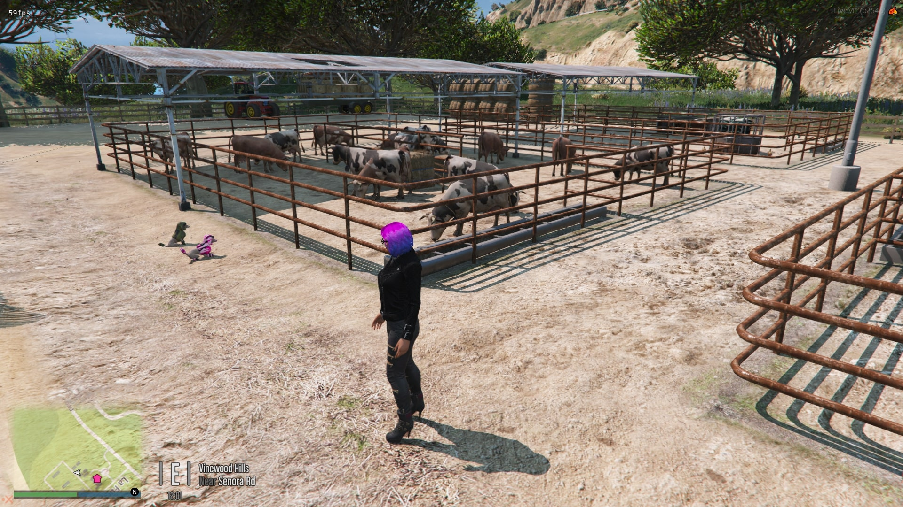 | 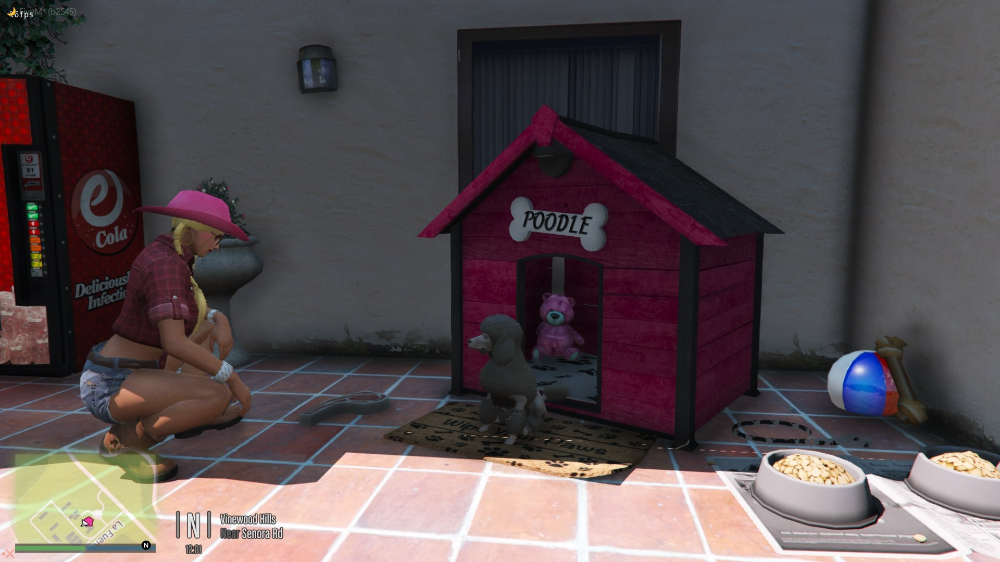 | 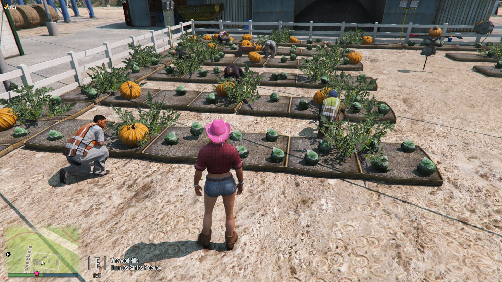 |
| 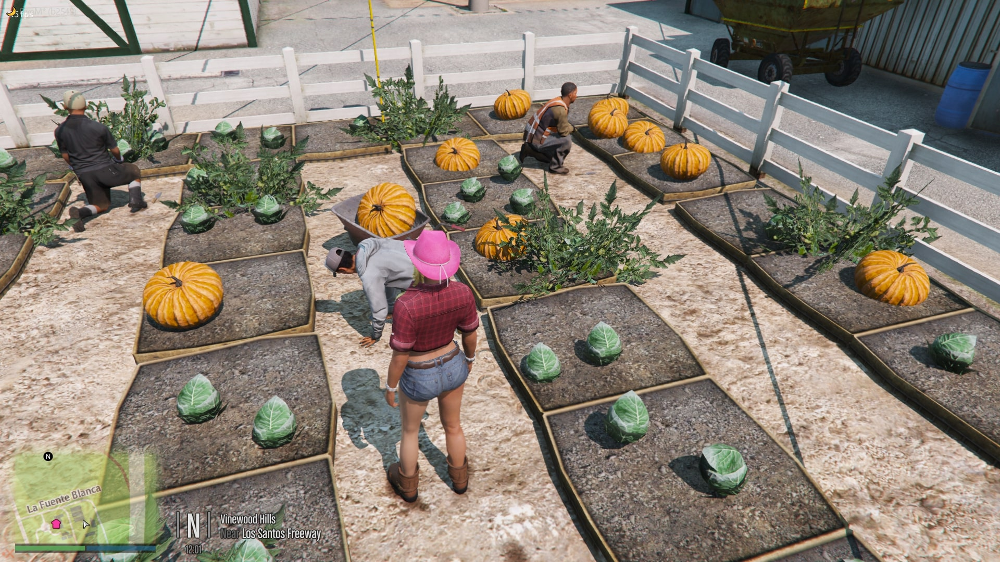 | 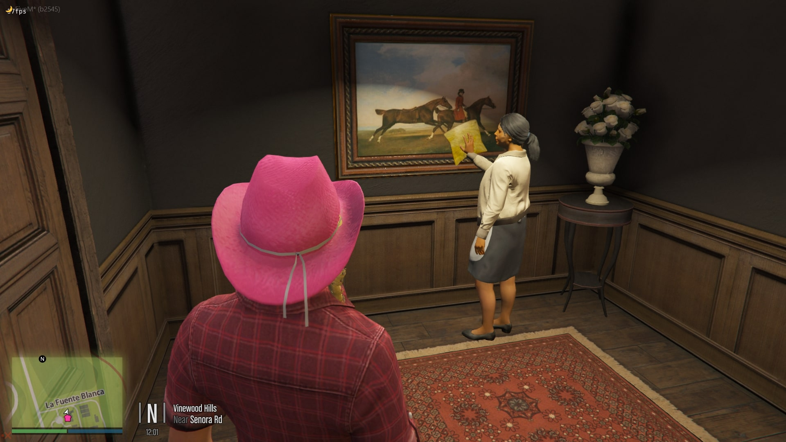 | 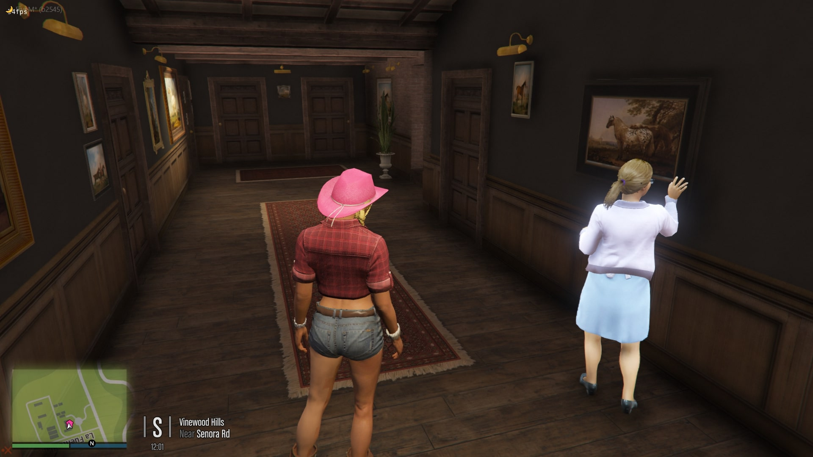 |
| 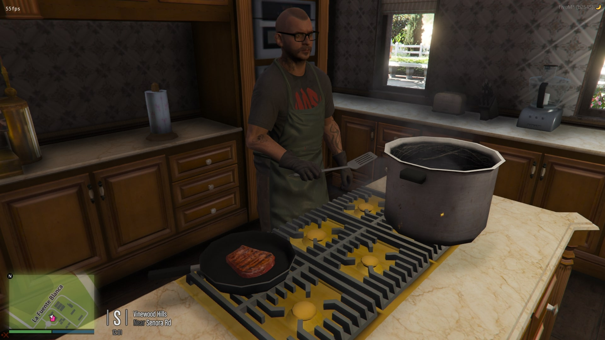 | 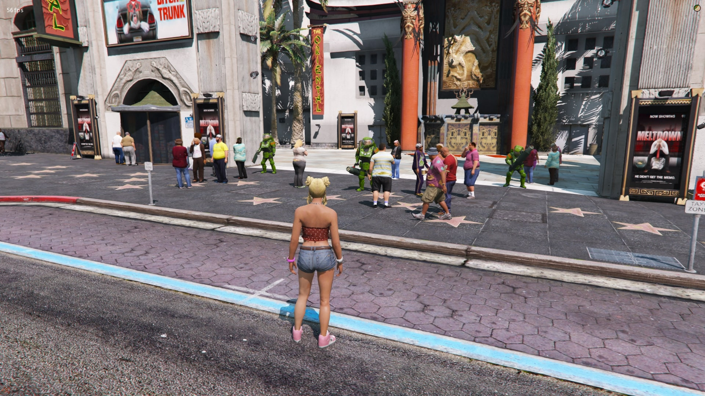 | 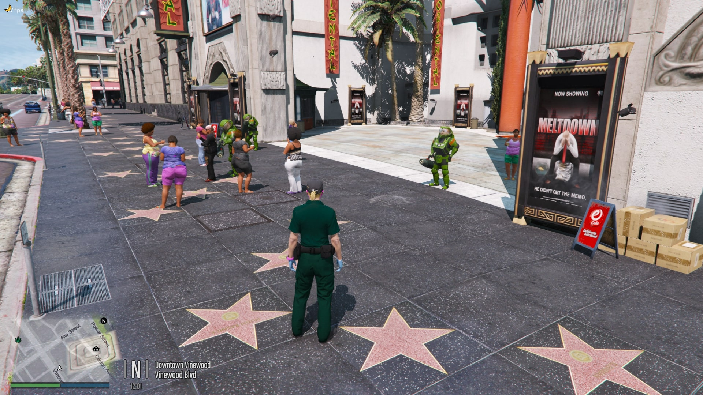 |
| 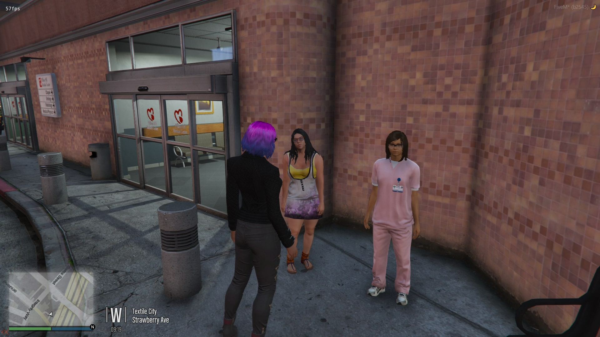 | 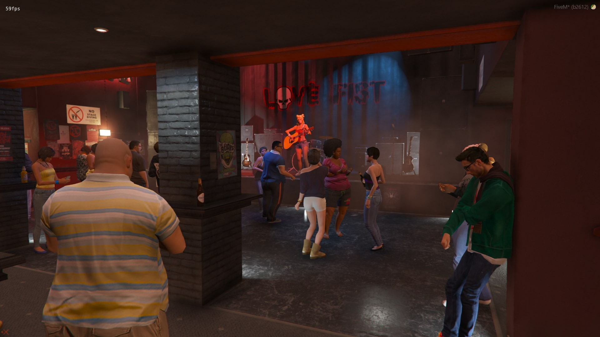 | 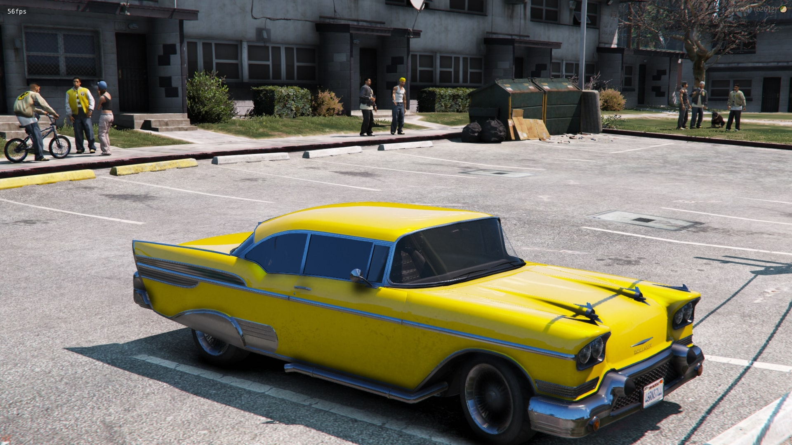 |
| 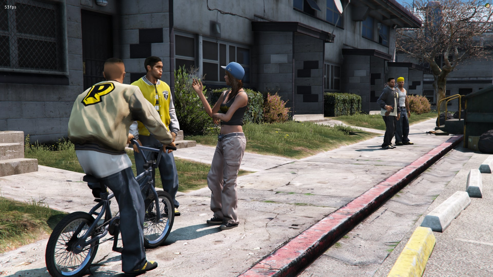 | 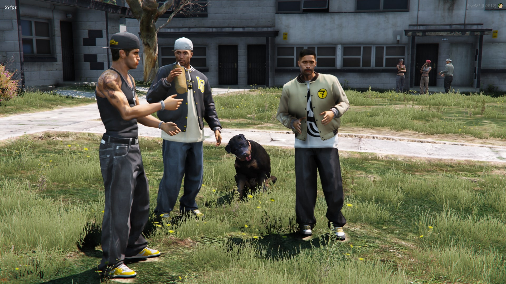 | 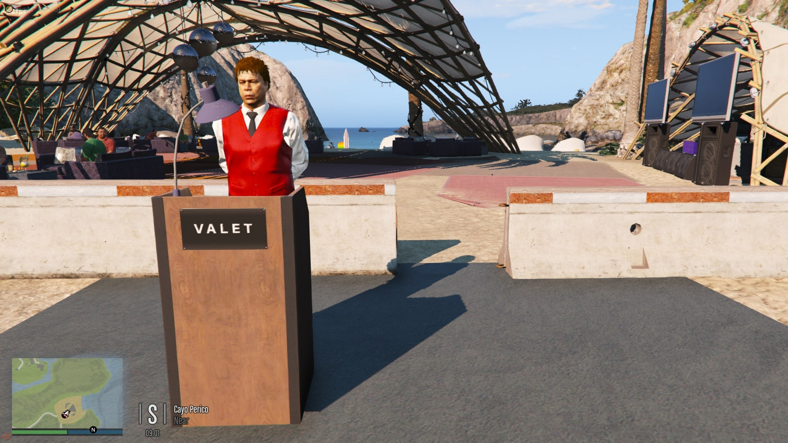 |
| 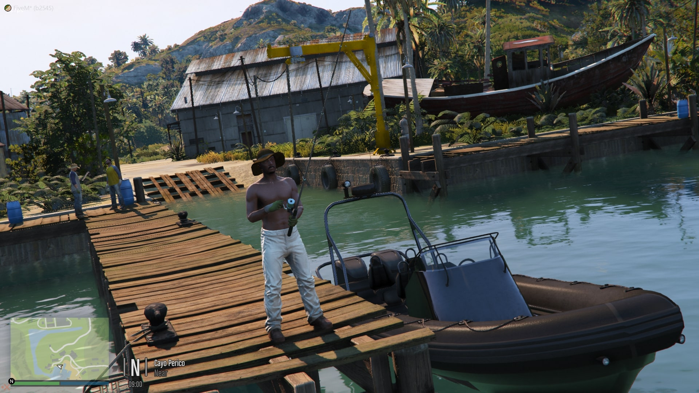 |  | 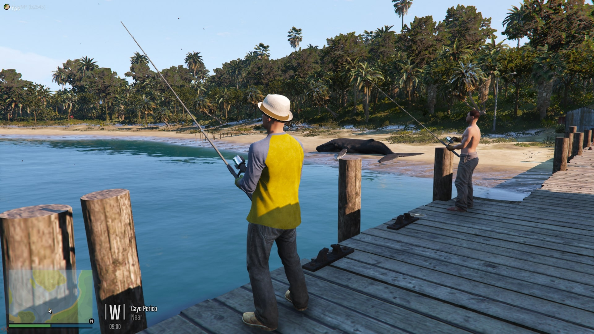 |


------------------

# FAQ 💬:

**Q: When loading into the server, it crashes to desktop and I am greeted with an error message. Help!**

**A:** Remove `main` from the folder name. It must be called server_scenarios.

------------------

**Q: How can I tell if this resource is working?**

**A:** All scenario files up until 2612 (aka mpg9ec) are being streamed. Visit Madrazo's Ranch (aka La Fuente Blanca) and you should see that there are deers, pigs, chickens, cows and poodles.

*(See screenshots above.)*


**If you don't see them, try noclipping or teleporting somewhere else, set time to midday and come back.**

------------------

**Q: Can you please make this work with XXXX DLC!**

**A:** It should already work for DLCs above 2189 Cayo Perico DLC.

------------------

**Q:** A new DLC just dropped with new scenarios, how do I add them?

**A:** Open codewalker and enable DLC Level to the new DLC. Start a new project and visit the location where the new DLC scenarios take place.
Add it to your project and save it to the resource's stream folder.

If it overrides an existing scenario YMT, you will not need to do anything else.

If it is a new scenario file, you will need to use Codewalker RPF Explorer to update your sp_manifest. 

The easiest way is to open Codewalker RPF explorer and search for `sp_manifest.ymt`. There'll be a few, so search them for the new DLC scenario. Once you find it, export it as XML and change the name to scenarios.xml.pso.

Add the sp_manifest from this resource into Codewalker RPF Explore and export as XML. Rename it as sp_manifest.xml.pso.

Edit it in a text editor such as Notepad++ or visual studio, paste everything from scenarios.xml.pso inside the sp_manifest.xml.pso and hit save, then search and replace `platform:/levels/gta5/` with `compcache:/server_scenarios.

------------------

**Q: Can I contact you on Discord or anywhere else for one on one support?**

**A:** NO. If you do happen to tag me in any of the discord servers I am in regarding this resource, or DM me on the FiveM forums, you will be ignored.

------------------

# License 

**This repository by TayMcKenzieNZ does not contain a license and is strictly open source, therefore you are not allowed to add one and claim it as yours.**

**You are not allowed to sell this nor re-distribute it.** 

**You are not allowed to change/add a license. If you want to modify it, you are free to do so, as long as you do not plan to sell it.** 

**Pull requests are accepted as long as they do not contain breaking changes.** 

You can read more here [HERE](https://opensource.stackexchange.com/questions/1720/what-can-i-assume-if-a-publicly-published-project-has-no-license)

------------------

# More Info

Credit goes to d-bub on Discord for the discovery of the required 

```lua
data_file "SCENARIO_POINTS_OVERRIDE_PSO_FILE" "sp_manifest.ymt"
```

Long story short about PSO, is that allows proper data format to be used rather than "fake" ymt files, which translates in ability to stream particular scenario files. No longer do we need to stream 100+ scenarios / all just to keep the server from crashing.

------------------

- Inside the sp_manifest.ymt:

+ **compcache:/server_scenarios/**

+ **"compcache"**  = Means the streamed file is "custom/modified"

+ **"/server_scenarios/"**  = Is where the scenario file is stored, NOT A VANILLA/unmodified file

+ **"stables"**  = File name without extension, do not use uppercase or spaces if you stream a custom file name


- **Using the same name as a default original GTA 5 scenario, will override the default scenario**

+ Vanilla scenario files need `platform:/levels/gta5/` to be replaced with `compcache:/server_scenarios/`, I have already done this for you

+ Only files that are on "sp_manifest.ymt" will stream, if file does not exist, no scenarios for a particular area will play therefore all scenarios have been added
