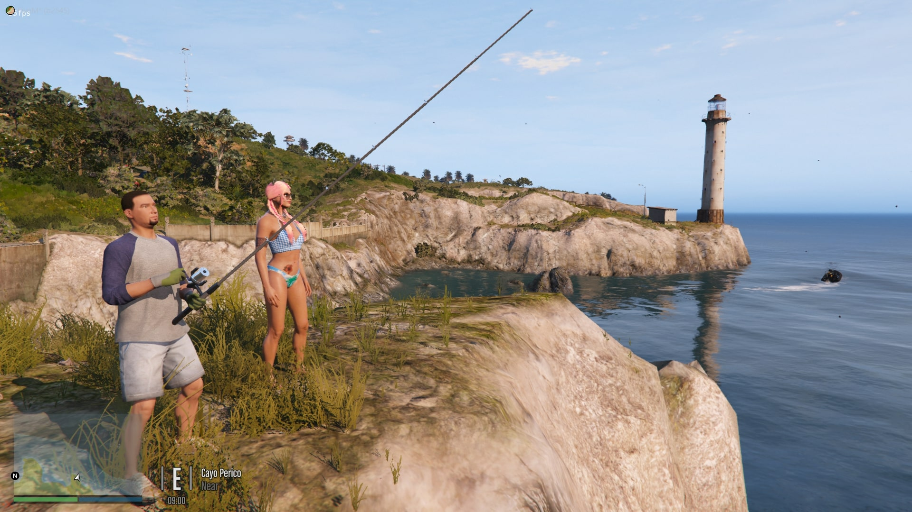

# server_scenarios 🚶‍♂️


A FiveM resource by TayMcKenzieNZ allowing custom and modified scenarios to work in your servers.

Contains modified stables scenario at Madrazo's Ranch and downtown construction scenario.

**This resource requires gamebuild 2189 (Cayo Perico) or higher, as the sp_manifest was taken from that DLC.**

You can force your FiveM server to 2189 or higher by reading my [tutorial](https://forum.cfx.re/t/tutorial-forcing-gamebuild-to-casino-cayo-perico-or-tuners-update/4784977)

------------------


**This is by all means a "work in progress" release, and is a test of my abilities streaming and overriding scenarios in FiveM.**

------------------

# Scenarios Included: ⚙️

# stables 🐴

- Workers at Madrazo's Ranch

- Poodles at Madrazo's Ranch 🐩

- Maids inside interior of Madrazo's Ranch 

- Personal chef inside interior of Madrazo's Ranch 👨‍🍳

*To work alongside [Ranch De Caniche](https://github.com/TayMcKenzieNZ/Ranch-De-Caniche)*

------------------

# mission_row 👮

- Removed interior scenario peds 

- Removed vehicle scenario spawns from Mission Row Police Department 

------------------

# downtown_construction_site 👷

- Removed construction NPC scenarios

*To work alongside [Map Fixes](https://github.com/TayMcKenzieNZ/MallFixes)* see screenshot 1 and 2

------------------

# countryside 🌽

Removed scenario peds from The Yellow Jack Inn and it's interior

------------------

# pillbox_hill 🏥 & downtown

Removed scenario peds from inside the bounds of Legion Square for use with custom MLOs, as well as making peds nearby the hospital high priority, changed two peds to medics and enabled ambulance spawn scenarios.

------------------

# strawberry  👠

Removed interior scenario peds from Vanilla Unicorn for use with custom MLOs

------------------

# island_drug_fields 🌴

Replaced Cayo Perico's scenario file and added additional scenarios. **REMOVE THIS FROM STREAM FOLDER AND sp_manifest.ymt IF GAMEBUILD IS LOWER THAN 2189**

------------------

# race_course 🎲

'Enabled' scenario peds at Diamond Casino & Resort rooftop and exterior

------------------

# eclipse 🍸

'Enabled' scenario peds inside Te-Qui-La-La. **Remove if this is a custom MLO location for your server**

------------------

# gwc_and_golfing_society ⛳

'Enabled' scenario peds at golf course

------------------

# davis_megamall 🟣

'Reenabled' scenario peds at Grove Street

------------------

# vinewood ⭐

'Enabled' scenario peds at Vinewood Boulevard

------------------

# banning 🟡

'Reenabled' Vagos scenario peds

------------------

# cypress_flats 🟡

'Reenabled scenario peds at Cypress Flats containing Vagos gang

------------------

# chamberlain_hills 🟡

'Reenabled scenario peds at Cypress Flats containing Vagos gang

------------------

# lost_mc 🏍️

'Reenabled' Lost MC near Casino

------------------

# south_los_santos.ymt ☀️

'Reenabled' scenario peds near Franklin's Aunts' house

------------------

# richman 🐰

'Reenabled' 'Playboy Mansion' scenario peds and vehicle spawns

------------------

# los_santos_freeway 👮🏻‍♂️

'Reenabled' Vinewood Police Department scenario points

------------------

# hawick 👮🏻‍♂️

'Reenabled' Vinewood Police Department continued

------------------

# downtown_vinewood🍔

'Reenabled' Up N Atom scenario points

------------------

# los_santos_international_airport ✈️

'Reenabled' Airport scenarios

------------------

# vinewood 🤩

'Reenabled' Republican Space Rangers and tourists on Vinewood Boulevard 

------------------

# ng_panes ✈️

'Reenabled' Fort Zancudo scenario points and vehicle spawns

------------------

# rancho 🚓

'Reenabled' Davis Police Department scenarios

------------------

# davis 🚓

Continued 'Reenabled' Davis Police Department, Fire Department and Central Los Santos Medical Center scenarios

------------------

# Installation Instructions ⚙️

- Click the green button that says `code` and select `Download Zip`

- Open with WinZip, WinRar or 7Zip

- Select the `server_scenario` folder and drag it into your FiveM server and/or scripts folder

- add `start server_scenarios` to your server.cfg

- Restart server or type /start server_scenarios into the chat


------------------

# How To Add Scenarios 🚶‍♂️

- Join the [Codewalker Discord](https://discord.gg/MKzzKKxFv8) and grab the latest codewalker version from the `#releases` channel

- Drag and drop `sp_manifest.ymt` into Codewalker RPF Explorer with edit mode on

- Right click, export as xml onto your desktop, now it will open in any text editor

- It will appear on your desktop as `sp_manifest.ymt.pso`

- Open `sp_manifest.ymt.pso` inside of a text editor and add your new scenario entry

- Open `scenario info.txt` which I have provided

- Find the scenario information to copy and paste into the `sp_manifest.ymt.pso` that you exported to XML via Codewalker

Once you have pasted the required scenario information, rename `platform:/levels/gta5/scenario/blablabla` to `compcache:/server_scenarios/blablablabla`.

It should look like so:

```xml
<Item type="CScenarioPointRegionDef">
   <Name>compcache:/server_scenarios/downtown_construction_site</Name>
   <AABB>
    <min x="-368.8696" y="-1183.929" z="17.63847" />
    <max x="46.45136" y="-781.7375" z="107.8484" />
   </AABB>
  </Item>
```

- In Codewalker RPF Explorer, delete sp_manifest and right click, import xml, and select your newly modified `sp_manifest.ymt.pso` file.

- Congratulations! It is now a ymt file

- Drag the newly modified `sp_manifest.ymt` into your server's `server_scenario` folder

- Override the current `sp_manifest.ymt` that is in your server's `server_scenarios` resource

- Enjoy your new / customised scenarios streaming to your server.


------------------

# How To Add Interior Scenarios 🏠🕺

Upon researching Mission Row Police Department and Legion Square's interior scenarios, I noticed that the `interior` parameter for MRPD had `v_policehub`.

If we use the [Pleb Master's Website](https://forge.plebmasters.de/mlos) to search for GTA 5 MLO interiors, we can see that v_policehub is the name of the interior.

I am uncertain of how we could go about getting interior scenarios to work inside custom MLO interiors, however I assume the `v_blablabla` would be replaced with the mlo. If you are using a custom MRPD MLO, try using `v_policehub` in the scenario point's `interior` parameter 🤔


------------------

# ⚠️ Important Notice

The resource and the scenarios **must** be in *lowercase* and must match what is written in the sp_manifest file.

For example, if you rename the resource to `nopixel_scenarios` , you must change the file paths in the sp_manifest to match the resource name;

`<Name>compcache:/nopixel_scenarios/downtown</Name>`

------------------

I have personally tested the [following scenarios](https://www.gta5-mods.com/scripts/scenario-groups) alongside this resource, and can confirm that they are working in FiveM.

------------------

# Screenshots 📸

| | | |
|-|-|-|
|  |  |  |
|  |  |  |
|  |  |  |
|  |  |  |
|  |  |  |
|  |  |  |


------------------

# FAQ 💬:

**Q: When loading into the server, it crashes to desktop and I am greeted with an error message. Help!**

**A:** Remove `main` from the folder name. It must be called server_scenarios.

------------------

**Q: How can I tell if this resource is working?**

**A:** Visit Madrazo's Ranch (aka La Fuente Blanca) and you should see that there are deers, pigs, chickens, cows and Poodles.

*(See screenshots above.)*


**If you don't see them, try noclipping or teleporting somewhere else, set time to midday and come back.**

------------------

**Q: Can you please make this work with XXXX DLC!**

**A:** It should already work for DLCs above 2189 Cayo Perico DLC, do let me know if it doesn't

------------------

**Q: Can I contact you on Discord or anywhere else for one on one support?**

**A:** NO. If you do happen to tag me in any of the discord servers I am in regarding this resource, or DM me on the FiveM forums, you will be ignored.

------------------

# License 

**This repository by TayMcKenzieNZ does not contain a license and is strictly open source, therefore you are not allowed to add one and claim it as yours.**

**You are not allowed to sell this nor re-distribute it.** 

**You are not allowed to change/add a license. If you want to modify it, you are free to do so, as long as you do not plan to sell it.** 

**Pull requests are accepted as long as they do not contain breaking changes.** 

You can read more here [HERE](https://opensource.stackexchange.com/questions/1720/what-can-i-assume-if-a-publicly-published-project-has-no-license)

------------------

# More Info

Credit goes to d-bub on Discord for the discovery of the required 

```lua
data_file "SCENARIO_POINTS_OVERRIDE_PSO_FILE" "sp_manifest.ymt"
```

Long story short about PSO, is that allows proper data format to be used rather than "fake" ymt files, which translates in ability to stream particular scenario files. No longer do we need to stream 100+ scenarios / all just to keep the server from crashing.

------------------

- Inside the sp_manifest.ymt and short how to

+ **compcache:/server_scenarios/**

+ **"compcache"**  = Means the streamed file is "custom/modified"

+ **"/server_scenarios/"**  = Is where the scenario file is stored, NOT A VANILLA/unmodified file

+ **"stables"**  = File name without extension, do not use uppercase or spaces if you stream a custom file name


- **Using the same name as a default original GTA 5 scenario, will override the default scenario**

+ Vanilla scenario files will need `platform:/levels/gta5/` to be replaced with `compcache:/server_scenarios/`

+ Only files that are on "sp_manifest.ymt" will stream, if file does not exist, no scenarios for a particular area will play
